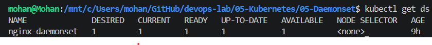
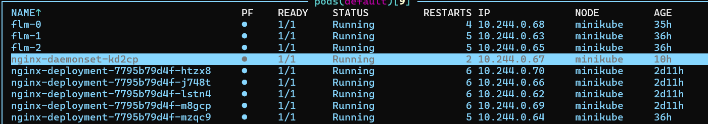
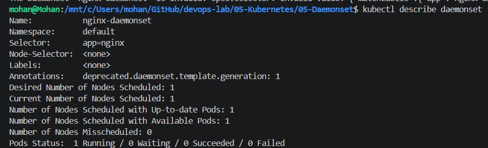

# DaemonSet Hands-on

## Objective

Learn how DaemonSets work and understand when to use them.

## What is a DaemonSet?

A DaemonSet ensures that one Pod runs on every eligible Kubernetes node.

Unlike a Deployment, you do not specify replicas.

## Use Cases

- Node monitoring (Prometheus Node Exporter)
- Log collection (Fluent Bit / Fluentd)
- Security agents
- Network plugins (Calico, Cilium)
- Storage drivers (CSI)

## Lab

1. Created a DaemonSet.
2. Applied the YAML.
3. Verified DaemonSet creation.
4. Verified Pod creation.
5. Compared DaemonSet with Deployment.

## Commands Used

See `commands.md`.

## Output

### 1. DaemonSet Created

### 2. DaemonSet Pod

### 3. DaemonSet Details

## Learning

- Deployment manages replicas.
- DaemonSet manages nodes.
- One Pod is automatically created per node.
- Adding a new node automatically creates another DaemonSet Pod.