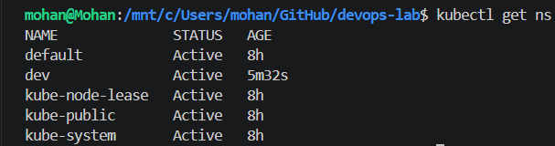
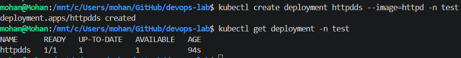

# Kubernetes - Namespaces

## Objective

Learn how Kubernetes Namespaces logically isolate resources within the same cluster.

---

## What is a Namespace?

A Namespace is a virtual partition inside a Kubernetes cluster. It allows multiple teams, applications, or environments (dev, test, prod) to use the same cluster without resource conflicts.

---

## Lab Tasks

* View existing namespaces.
* Create a new namespace (`dev`).
* Deploy an Nginx application into the `dev` namespace.
* Verify resources in different namespaces.
* Change the default namespace for the current context.
* Restore the default namespace.

---

## Files

* `namespace.yaml`
* `commands.md`

---

## Screenshots

### 1. Existing Namespaces



### 2. Namespace Created


### 3. Nginx Deployment in dev Namespace




---

## Key Learnings

* Namespaces provide logical isolation.
* Resources are namespace-scoped unless explicitly cluster-scoped.
* `kubectl` works with the `default` namespace unless another namespace is specified.
* The current namespace can be changed using the current kubeconfig context.

---

## Cleanup

```bash
kubectl delete namespace dev
```
