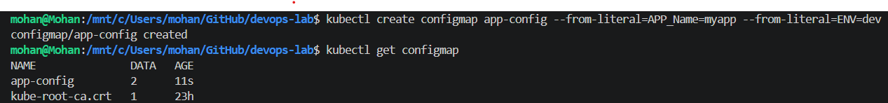
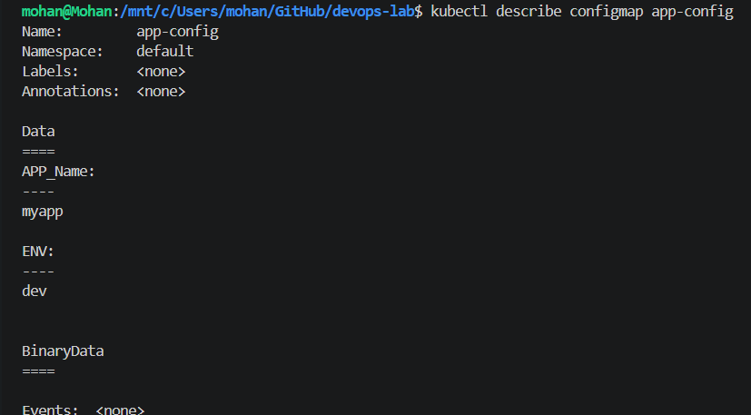
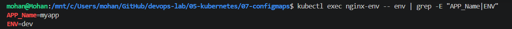
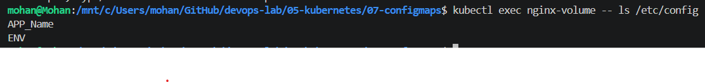
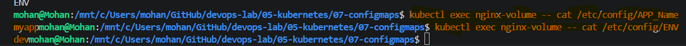

# Kubernetes - ConfigMaps

## Objective

Learn how to create and use ConfigMaps to externalize application configuration without modifying the container image.

---

## What is a ConfigMap?

A ConfigMap is a Kubernetes object that stores **non-sensitive configuration** as key-value pairs.

Instead of hardcoding configuration inside the application or Docker image, the configuration is stored separately and consumed by Pods.

Examples:

* Application name
* Environment (dev/test/prod)
* Log level
* Database host
* API endpoint

> **Note:** Never store passwords, API keys, or certificates in a ConfigMap. Use a Secret instead.

---

## Lab Tasks

* Create a ConfigMap.
* View the ConfigMap.
* Use a ConfigMap as environment variables.
* Mount a ConfigMap as files inside a Pod.
* Verify the mounted configuration.

---

## Files

* `pod-env.yaml`
* `pod-volume.yaml`
* `commands.md`

---

## Screenshots

### 1. ConfigMap Created



### 2. ConfigMap Details



### 3. ConfigMap as Environment Variables



### 4. ConfigMap Mounted as Files



### 5. Reading Mounted Configuration



---

## Key Learnings

* ConfigMaps store non-sensitive configuration.
* Configuration is separated from the application code.
* One Docker image can be reused across multiple environments.
* Pods can consume ConfigMaps as environment variables or mounted files.
* ConfigMaps improve application portability and simplify configuration management.

---

## Cleanup

```bash
kubectl delete pod nginx-env
kubectl delete pod nginx-volume
kubectl delete configmap app-config
```
