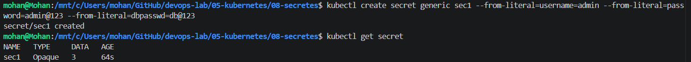
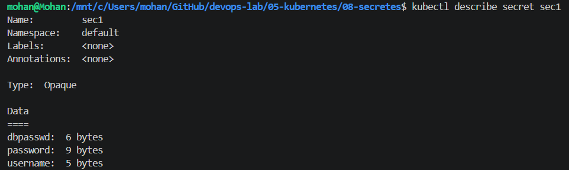
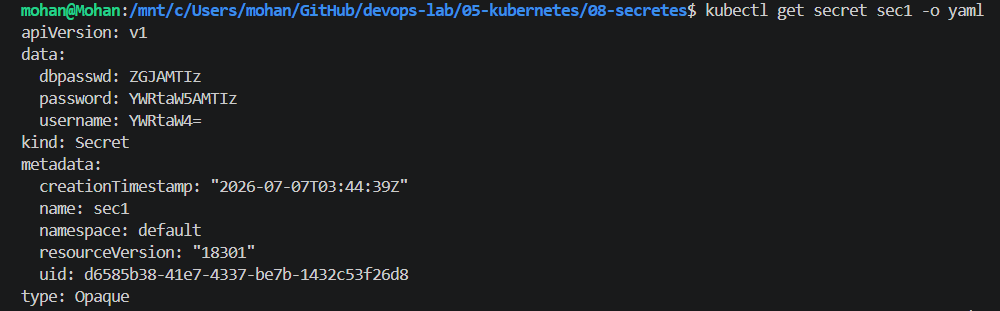
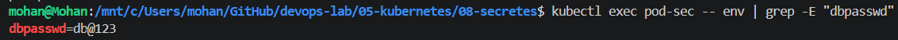

# Kubernetes - Secrets

## Objective

Learn how to securely store and consume sensitive information in Kubernetes using Secrets.

---

## What is a Secret?

A Secret is a Kubernetes object used to store sensitive data such as passwords, API keys, tokens, SSH keys, and TLS certificates.

Instead of hardcoding sensitive information inside the application or Docker image, Kubernetes stores it separately and allows Pods to consume it securely.

> **Note:** Kubernetes Secrets are **Base64 encoded**, not encrypted by default. In production, enable **Encryption at Rest** and use **RBAC** to secure access.

---

## Lab Tasks

* Create a Secret using literal values.
* View the Secret.
* Decode Base64-encoded data.
* Consume a Secret as environment variables.
* Mount a Secret as files inside a Pod.
* Verify the mounted Secret files.

---

## Files

* `pod-secret-env.yaml`
* `pod-secret-volume.yaml`
* `commands.md`

---

## Screenshots

### 1. Secret Created



### 2. Secret Details



### 3. Secret YAML



### 4. Secret as Environment Variables




---

## Key Learnings

* Secrets store sensitive configuration.
* Secrets are Base64 encoded by default.
* Pods can consume Secrets as environment variables or mounted files.
* Never store passwords inside ConfigMaps or Docker images.
* Production environments should use Encryption at Rest and RBAC.

---

## Cleanup

```bash
kubectl delete pod pod-secret-env
kubectl delete pod pod-secret-volume
kubectl delete secret db-secret
```
