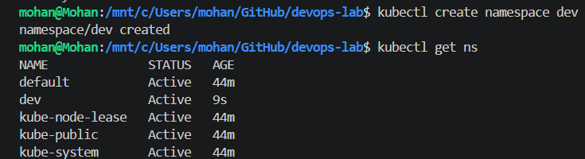
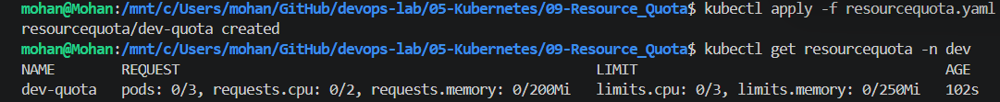
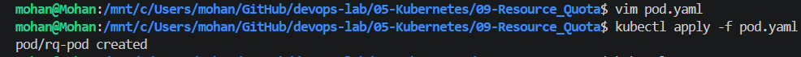

# Kubernetes - ResourceQuota

## Objective

Learn how to use ResourceQuota to limit resource consumption within a Kubernetes namespace and prevent one team or application from consuming excessive cluster resources.

---

## What is a ResourceQuota?

A ResourceQuota is a Kubernetes object that limits the total amount of resources that can be consumed within a namespace.

It helps administrators control the usage of resources such as Pods, CPU, and Memory by different teams or applications sharing the same Kubernetes cluster.

---

## Why do we use ResourceQuota?

In production, multiple teams or applications often share the same Kubernetes cluster.

Without ResourceQuota:

* One team may accidentally create hundreds of Pods.
* One application may consume all available CPU or Memory.
* Other applications may fail to schedule Pods.

ResourceQuota ensures fair resource allocation and improves cluster stability.

---

## Lab Tasks

* Create a namespace.
* Create a ResourceQuota.
* Verify the ResourceQuota.
* Deploy Pods inside the namespace.
* Observe ResourceQuota enforcement.
* Understand Requests and Limits.

---

## Files

* `resourcequota.yaml`
* `pod.yaml`
* `commands.md`

---

## Screenshots

### 1. Namespace Created



### 2. ResourceQuota Created



### 3. ResourceQuota Details


### 4. Pod Created Successfully



---

## Key Learnings

* ResourceQuota works at the namespace level.
* It limits total resource consumption within a namespace.
* Pods must define resource requests and limits when required by the quota.
* ResourceQuota helps prevent resource starvation in shared clusters.
* ResourceQuota is commonly used together with LimitRange.

---

## Real-World Use Case

A Kubernetes cluster may host applications from multiple teams.

For example:

* Payment Team
* User Team
* Inventory Team
* Analytics Team

Each team receives its own namespace with a ResourceQuota to ensure that no single team consumes excessive CPU, Memory, or Pod resources.

---

## Cleanup

```bash
kubectl delete namespace dev
```
